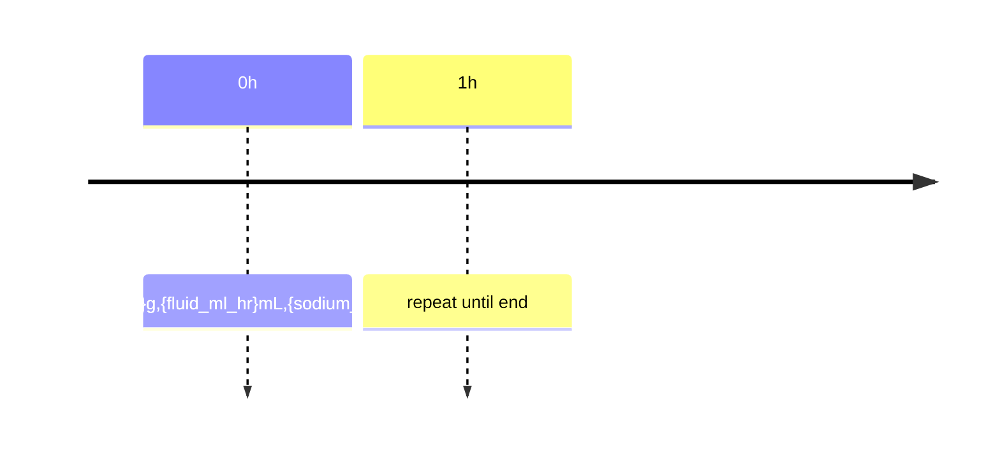

# Fuel engine spec
## Executive summary
I compute kJ/hr from FTP+IF(+TSS) and output carbs, fluids, sodium per hour plus totals.
## Inputs
|Field|Type(unit)|Req|
|---|---|:--:|
|ftp_w|f32(W)|Y|
|wt_kg,ht_cm|f32(kg,cm)|N|
|sweat_lph,temp_c,heavy_sweater|f32(L/h,°C),bool|N|
|ride: dur_h,IF,TSS (any2)|f32|Y|
## Formulas and rules
|Name|Formula|
|---|---|
|TSS|100*IF^2*dur_h|
|dur_h|TSS/(100*IF^2)|
|IF|sqrt(TSS/(100*dur_h))|
|NP_w|IF*ftp_w|
|kJhr|NP_w*3.6; kJtot=kJhr*dur_h| citeturn0search0turn0search4
Carbs: pct=clamp(0.45+0.1*(IF-0.75),0.4,0.5); ghr=pct*kJhr/4. Floors: (<1h&IF<0.7)->0 else >=30; (IF>=0.85&dur_h>=2)->>=60. Caps: 90; 120 if race+gut_trained. citeturn0search1turn0search2  
Total_g=round5(ghr*dur_h). Hourly: repeat ghr; last*=frac.  
Hydration: mLhr=1000*sweat_lph else {<=15:500,15-25:750,>25:1000}. Sodium: 500 mg/h; if hot or dur_h>=2 or IF>=0.8 ->1000; +500 if heavy_sweater. citeturn0search3turn0search7  
Edge: IF missing -> derive from (TSS,dur_h) else assume 0.65+flag. FTP missing -> CHO by duration only. citeturn0search1
## Outputs and examples
|Out|Type(unit)|
|---|---|
|carb_g_hr,total|f32(g/h,g)|
|fluid_ml_hr|f32(mL/h)|
|sodium_mg_hr|i32(mg/h)|
Ex1 FTP250 IF0.80 dur2h: kJhr720 ->81 g/h (160 g), 750 mL/h, 1000 mg/h.  
Ex2 FTP280 TSS150 dur3h: IF0.707 kJhr713 ->80 g/h (240 g), 1000 mL/h, 1500 mg/h.

Sources: TP; Jeukendrup; Podlogar22; USA Cycling.